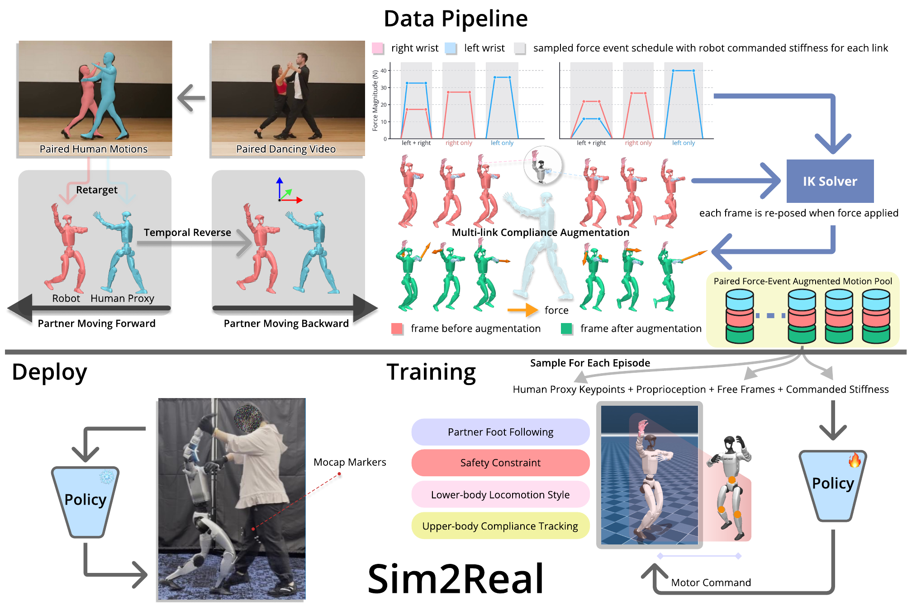

<div align="center">

# CoDance

**Learning Reactive and Compliant Human-Humanoid Interaction from Video**

[Zhuoqun Chen](https://zhuoqun-chen.github.io/), [Shucheng Jia](https://github.com/FlashJIA), [Boyuan Chen](http://boyuanchen.com/)

General Robotics Lab, Duke University

**[Website](https://generalroboticslab.com/CoDance)** / **[Video](https://youtu.be/ufOYmNZvLVU)** / **[Paper](https://arxiv.org/abs/2610.05324)** / **[PDF](https://arxiv.org/pdf/2610.05324)** / **[Dataset](https://huggingface.co/datasets/GeneralRoboticsLab/CoDance)** / **[Deploy](src/mjlab/tasks/codancing/simple_deploy/README.md)**



</div>

CoDance turns a single video of two dancers into force-aware training clips for a humanoid (Unitree G1) and trains policies that follow a human partner while responding compliantly to forces at both hands.
This repository contains the compliance augmentation that generates the training clips, the training and evaluation code, the trained policies and the real-robot deployment code accompanying the paper.
It is a fork of [mjlab](https://github.com/mujocolab/mjlab) (MuJoCo Warp simulation) with a vendored [rsl_rl](https://github.com/leggedrobotics/rsl_rl) fork that carries the adversarial-motion-prior additions.

To use the released policies, start with [Setup](#setup), then [watch](#watching-a-policy) or [evaluate](#evaluating-the-trained-checkpoints) one.
To rebuild them, go on to [Training](#training) and [Generating the data](#generating-the-data); [Real robot](#real-robot) runs a policy on a Unitree G1.

## Abstract

Partnered human-humanoid interaction couples locomotion with continuous physical contact.
A humanoid needs to coordinate with a person's motion while responding to interaction forces and maintaining stable and natural movement.
We present CoDance, a framework for learning reactive and compliant human-humanoid interaction from video.
We study partnered dancing as a challenging instantiation, where a humanoid coordinates its footsteps with a moving partner and maintains continuous two-hand contact.
Given a single video of two human dancers, CoDance retargets their motions into a robot reference and a moving partner.
We introduce a multi-link compliance augmentation that transforms the kinematic demonstration into force-aware training data by adapting the robot reference under structured forces at both hands.
Policies trained on this data follow the observed partner while preserving the demonstrated locomotion style and responding compliantly to physical interaction.
In simulation, the policies adapt their footsteps to changes in the partner and reproduce approximately 80% of the wrist displacement encoded by the augmented demonstrations.
On a physical humanoid, CoDance enables sustained two-hand dancing with a human partner including repeated transitions between forward and backward motions.

## Setup

Linux with an NVIDIA GPU and [uv](https://docs.astral.sh/uv/); uv installs the pinned Python and everything else, including the CUDA 12.8 build of torch.

```sh
git clone https://github.com/generalroboticslab/codance.git CoDance && cd CoDance
make sync
uvx --from huggingface_hub hf download GeneralRoboticsLab/CoDance \
    --repo-type dataset --local-dir . --include "data/*"
```

The download is the pre-generated data (about 850 MB), hosted on [Hugging Face](https://huggingface.co/datasets/GeneralRoboticsLab/CoDance): the two clip pools the policies were trained on, the seven checkpoints and their ONNX exports.
It lands where the tracked configs expect it (`data/compliant/rc/...` and `data/checkpoints/...`), so training and evaluation run on it as downloaded; [Generating the data](#generating-the-data) builds the pools yourself instead.

Run Python through `uv run`: it uses the environment `make sync` built, torch included, so no command reinstalls anything.
To deploy on the real robot, sync with `make sync-deploy` instead (see [Real robot](#real-robot)).
Run every command from the repository root.

## The policies

CoDance trains one policy of each kind of locomotion objective on the same data: the **decoupled** policy (an adversarial style reward for the lower body, reference tracking for the upper body) and the **whole-body** tracker.
The repository also includes their baselines and ablations, and a standing policy.
The decoupled policy is the one that dances with a person on the real robot.

| Policy | What it is |
|---|---|
| `decoupled` | Decoupled: adversarial style reward for the lower body |
| `wholebody` | Whole-body: tracks the whole reference |
| `decoupled_wo_adversarial` | ablation: `decoupled` without the adversarial term |
| `decoupled_wo_chaining` | ablation: `decoupled` trained without clip chaining |
| `wholebody_wo_foot_constraint` | baseline: `wholebody` without the foot constraint |
| `stiff` | baseline: the stiff tracker, which tracks the free reference |
| `stand` | the standing policy (solo, force events on the wrists) |

The first six dance the waltz opposite a simulated partner, a second G1 that replays the other dancer from the video.
Each policy is three files, named after it:

- `src/mjlab/tasks/codancing/config/g1/conf/<policy>.yaml`, its config: the one file that trains it, stating the run's settings over the shared `run.yaml`.
- `data/checkpoints/<policy>.pt`, the published checkpoint.
  It embeds its frozen train and eval configurations, so playing and evaluating it need no other file.
- `data/checkpoints/<policy>.onnx`, its actor exported for the real-robot runners.

## Watching a policy

```sh
uv run python -m mjlab.scripts.run play --ckpt data/checkpoints/decoupled.pt \
    --overlay play --override env.scene.num_envs=1
```

`play` rebuilds the checkpoint's training world and runs the policy in it.
`--overlay play` switches to the conditions the evaluations use (no episode time limit, no observation noise), and `env.scene.num_envs=1` replaces the training run's 16384 environments, which do not fit a 12 GB GPU.
The native MuJoCo viewer opens when a display is available and the browser viewer (viser, on port 8080) otherwise; pick one with `--override session.viewer=native` or `--override session.viewer=viser`.

To also see the reference as a green ghost and the force events as arrows:

```sh
uv run python -m mjlab.scripts.run play --ckpt data/checkpoints/decoupled.pt \
    --overlay play --override env.scene.num_envs=1 \
    --override session.debug_vis.enabled=true \
    --override session.debug_vis.compliance_force_arrow=true
```

The first clip may have no force events; [Eval videos](#eval-videos) shows how to pin one that has.

## Evaluating the trained checkpoints

An evaluation runs a checkpoint's policy without training and records every step.
It comes in two sizes:

- `run eval` replays one of the eval recipes frozen in the checkpoint: one environment for 20 or 30 seconds, with a video.
  Use it to look at a policy and to measure it on a single clip.
- `scripts/clip_metrics.py` evaluates a policy on a whole clip pool at once, one environment per clip, and reduces the rollout to per-clip metrics.

Both write the same session files, and both summarize them with the same offline analyzer.

### Eval recipes

The eval environments are frozen in the checkpoint, so the checkpoint alone rebuilds exactly what each recipe measures:

```sh
uv run python -m mjlab.scripts.run eval --ckpt data/checkpoints/decoupled.pt \
    --recipe stand
```

| Recipe | Each episode starts at frame 0 of a clip | Steps |
|---|---|---|
| `default` | in the reference pose | 1000 (20 s) |
| `stand` | standing in the default pose | 1000 (20 s) |
| `chain` | as `default`, clips chaining in pool order | 1500 (30 s) |
| `chain_stand` | as `stand`, clips chaining in pool order | 1500 (30 s) |

The six waltz policies carry all four recipes.
`stand` carries `default` and `chain`: its reference already starts standing, so the standing-start recipes would repeat them.
Without `--recipe` the eval runs `default`, and `--recipe all` runs every recipe of the checkpoint.

Use the `stand` recipe for the waltz policies and `default` for `stand`: the waltz policies never trained from the reference pose at frame 0 (training starts standing or at a random phase), so under `default` the decoupled policy falls in its first two episodes before it dances.

Every recipe runs on the policy's training pool, with no episode time limit (an episode ends when the robot falls or, for the waltz policies, when its feet drift too far from the partner's), no observation noise, and of the training randomization only the torso's center-of-mass offset and the foot friction, drawn once per environment.
A policy trained with clip chaining already chains into a random next clip when a clip ends; the `chain` recipes take the next clip in pool order instead, so on the waltz pools forward and reversed clips alternate, and they turn chaining on for `decoupled_wo_chaining`, whose episodes otherwise end with the clip.
A 20 s recipe takes about a minute on an RTX 4070 Ti.

`--override key=value` changes any leaf of the rebuilt configuration, for example `--override motion.motions=configs/clip_manifests/<pool>.yaml` to evaluate on another pool.
The session then counts as a modified measurement: its manifest lists the overrides under `deviations`.

### What a session writes

Sessions land next to the checkpoint, in `data/checkpoints/eval_sessions/<recipe>/` (for a checkpoint of your own, in `eval_sessions/<recipe>/` of its run directory).
Every file of a session is named `<policy>-<timestamp>`, followed by:

- `.yaml`, the session manifest: the checkpoint, the recipe's settings (number of environments, length, overlays), the deviations from the frozen recipe, the mean, max, min and count of every metric, the video, and a command that reproduces the session.
- `.rollout-envs.csv`, the table every number comes from: one row per step and environment, with the reset flag, the active clip, its time and length, one done flag per termination term (`term_*`) and every metric the command computes (`metric/*`).
- `.rollout-envs.summary.csv`, `.rollout-envs.phase.csv` and `.rollout-envs.analysis.json`, written by [the offline analyzer](#the-offline-analyzer).
- `-step-0.mp4`, the video (see [Eval videos](#eval-videos)).

The recipes record the tracking metrics: position and orientation errors between the robot and its reference, for the torso, the upper body, the lower body and the whole body, both in the world frame (`global`) and with the reference moved onto the robot's anchor body (`anchor_aligned`).
Three more metric suites measure compliance (force error), partner following (foot and pelvis distances) and the clips' force events (`clip_drag`).
In metric and config names, `served` is the reference the policy tracks (the adapted one), `free` the unforced reference, and `live` the robot itself.
The per-clip evaluation turns all four on; so does

```sh
SUITES="[robot_ref_tracking,compliance,partner,clip_drag]"
uv run python -m mjlab.scripts.run eval --ckpt data/checkpoints/decoupled.pt \
    --recipe stand --override "env.commands.codancing.metric_suites=$SUITES"
```

The metrics are defined in `src/mjlab/tasks/codancing/mdp/metrics.py`.

### The offline analyzer

`mjlab.tasks.codancing.eval_analysis` computes the summaries from the `.rollout-envs.csv` table.
Every eval runs it on its own table; run it again to analyze a table differently:

```sh
uv run python -m mjlab.tasks.codancing.eval_analysis \
    data/checkpoints/eval_sessions/stand/decoupled-<timestamp>.rollout-envs.csv \
    --settle 25 --out /tmp/analysis
```

It writes, next to the table or into `--out`:

- `<table>.summary.csv`: per metric, the mean, max, min and count over all rows (`ALL`) and per clip.
- `<table>.phase.csv`: the same statistics in ten bins of motion phase (clip time over clip length).
- `<table>.analysis.json`: both, plus the done count of each termination term, overall and per clip.

`--settle N` drops the first N steps after every reset.
`--seen <manifest>` adds a seen and unseen split (the clips of that manifest against the rest), and `--pool <manifest>` checks that every clip of that manifest has rows, exiting with status 2 when one has none.

### Per-clip evaluation over a pool

`scripts/clip_metrics.py` evaluates a policy on every clip of a pool in one session: one environment per clip, 500 steps (10 s) from the standing start (the `stand` recipe for the waltz policies, `default` for `stand`), all four metric suites on, the training observation noise (`--obs-noise 1`, the default) and no video.

```sh
uv run python scripts/clip_metrics.py --family waltz --policy decoupled \
    --pool full --seed 0
```

- `--pool own` is the policy's training pool (200 clips).
  `--pool full` doubles it with the next seeds of the same generator (400 clips) and splits the summary into the clips the policy trained on (seen) and the others (unseen: new force schedules from the same distribution, not out of distribution).
- `--seed` changes the per-environment draws (center-of-mass offset, foot friction, observation noise).
- `--policy all` runs every policy of the family.
  `--override` adds any `run eval` override and `--tag` names the variant in the output files, for example an evaluation with the partner observation scaled to zero.

Each run is an ordinary eval session in `data/checkpoints/eval_sessions/<recipe>/` (a 400-environment table is about 100 MB), analyzed with 25 settle steps into `logs/clip_metrics/<family>/<policy>[.full].s<seed>.noise1[.<tag>].*`: the same `summary.csv`, `phase.csv` and `analysis.json` the offline analyzer writes, `split.csv` with the seen and unseen means, `source.txt` naming the session table, and the eval's log.
A policy whose summary is complete is skipped; `--force` runs it again.
A 400-environment evaluation takes about 90 seconds on an RTX 4070 Ti.

`scripts/clip_drag.py` reads the same session tables for the clips' own force events: `summarize` writes one row per event and the grouped statistics under `logs/clip_drag/<family>/`, and `figures` plots them.

### Eval videos

Every recipe records environment 0 for its full length, at 854x480 and 50 frames per second, into `<policy>-<timestamp>-step-0.mp4` beside the session files.
The video shows the robot, its partner (for the waltz policies) and the reference motion as a translucent green ghost; during a force event, an arrow at the robot's wrist shows the applied force and a marker at the ghost's wrist the scheduled one.
The ghost is drawn at the reference's own world position while the robot is placed relative to its partner, so the two stand about 0.3 to 0.5 m apart; the anchor-aligned metrics remove that offset.

In most recipe videos the first clip has no force events.
To film one that has, pin a clip from the policy's pool (`ml_` clips carry force events, `zw_` clips are force-free):

```sh
c=env.commands.codancing.motion_cursor.source.episode_reset
uv run python -m mjlab.scripts.run eval --ckpt data/checkpoints/decoupled.pt \
    --recipe stand --override $c.clip_selection=pin \
    --override $c.pin_clip=ml_human_fwd_s3
```

The same two overrides pin the clip in `play`.
What a recipe draws comes from its own `debug_vis` block: change it with `--override eval.recipes.<recipe>.debug_vis.<key>=<value>`, since the `session.debug_vis` keys that play reads have no effect on eval.
`--override eval.recipes.<recipe>.video.enabled=false` skips the video, as the per-clip evaluation does.

## Training

```sh
CUDA_VISIBLE_DEVICES=0 uv run python -m mjlab.scripts.run train \
    --config src/mjlab/tasks/codancing/config/g1/conf/decoupled.yaml
```

Every released policy was trained with this command on a single GPU, and `CUDA_VISIBLE_DEVICES` picks which one.
The configs set `session.launch.gpu_ids: all`, which means every GPU visible to the process, so on a machine with several GPUs keep the variable pointed at one of them (or add `--override 'session.launch.gpu_ids=[0]'`).
The configs state 16384 parallel environments; add `--override env.scene.num_envs=4096` or lower to fit a smaller GPU.
Training logs to [Weights & Biases](https://wandb.ai) (every config sets `logger: wandb`): run `uv run wandb login` once, or set `WANDB_MODE=offline` to keep the logs on disk only.

A run writes to `logs/rsl_rl/codance/<timestamp>_<policy>/`, with a checkpoint `model_<iteration>.pt` of about 27 MB every 100 iterations, up to the configs' 50000 iterations (about 13 GB of checkpoints).
Each checkpoint embeds its frozen configurations like the published ones, so `play --ckpt` and `eval --ckpt` work on it exactly as on the published ones, and its eval sessions land in the run directory.

`mjlab.scripts.run` has five subcommands: `train`, `resume` (continue a run in place, with its optimizer and iteration), `fork` (a new run from a checkpoint's weights), `eval` and `play`.
`--override key=value` edits any leaf of a config on the command line, `--dry-run` writes the resolved configurations to `/tmp` without running, and `uv run python -m mjlab.scripts.run --help` prints every option.

## Generating the data

The clip pools on Hugging Face are the ones the policies were trained on, so training needs no generation step.
To build the pools yourself, start from the two tracked source motions: `data/reference_motion_edits_g1_g1_waltz/` (the waltz clip retargeted from video, human and robot, forward and reversed) and `data/reference_motion_stand/` (the standing clip).
The recipes in `datagen.justfile` run under [just](https://github.com/casey/just), installed from PyPI with `uv tool install rust-just`.

1. Generate a pool.
   A run takes hours of IK solves, and `rc.yaml` inside the pool records the sampler settings and seeds that produced it.
   The folder is named after today's date, so it never lands in a downloaded pool (those carry `20260830`).

   ```sh
   just multilink-rc-paper small              # the waltz pool
   just multilink-rc-paper small false stand  # the standing pool
   ```

   They write `data/compliant/rc/<yyyymmdd>_comz_small_002/` and `data/compliant/rc/<yyyymmdd>_stand_comz_small_002/`.

2. Write the manifests the configs train on: 100 clips with force events and 100 force-free ones.
   The stiff tracker follows the free (unforced) reference, so its manifest adds `original`.

   ```sh
   just multilink-manifest 100ml_100zw <yyyymmdd>_comz_small_002
   just multilink-manifest 100ml_100zw <yyyymmdd>_comz_small_002 original
   just multilink-manifest 100ml_100zw <yyyymmdd>_stand_comz_small_002
   ```

   They write `multilink_waltz_100ml_100zw_<yyyymmdd>_comz_small_002.yaml`, the same name with `_track_original` for the stiff tracker, and `multilink_stand_100ml_100zw_<yyyymmdd>_stand_comz_small_002.yaml`, all in `configs/clip_manifests/`.

3. Train a policy on its manifest.
   The override also points the frozen eval recipes at the new pool.

   ```sh
   uv run python -m mjlab.scripts.run train \
       --config src/mjlab/tasks/codancing/config/g1/conf/<policy>.yaml \
       --override motion.motions=configs/clip_manifests/<manifest>.yaml
   ```

`datagen.justfile` documents every recipe and parameter.

Look at an augmented clip (forward kinematics only, no simulation):

```sh
CLIP=data/compliant/rc/20260830_comz_small_002
CLIP=$CLIP/waltz_20260224_001_multilink_contact_seed0.npz
uv run python scripts/clip_viz/render_clip_video.py --help
uv run python scripts/clip_viz/plot_force_curve.py --contact $CLIP
uv run python scripts/clip_viz/plot_stiffness_curve.py \
    --out-dir /tmp/stiffness $CLIP
```

`render_clip_video.py` writes an mp4 with the forced link marked on every frame; the two plots draw the force of each slot against the frame, and the force with the stiffness of each slot.

## Real robot

Deploying on a Unitree G1 needs the `deploy` extra, which adds the G1 SDK binding and onnxruntime.
On the robot's control computer, sync with it in place of `make sync`, which would remove the extra again:

```sh
make sync-deploy   # uv sync --extra deploy
```

The standing and dancing runners load the exported policies (`data/checkpoints/stand.onnx`, `data/checkpoints/decoupled.onnx`), and the partner is tracked live with a VICON system; `src/mjlab/tasks/codancing/simple_deploy/README.md` explains the setup and the operator procedure.
None of this is needed for the simulation experiments.

## Repository layout

- `src/mjlab/tasks/codancing/`: the task (commands, observations, rewards, events, metrics, the motion cursor and the force field), the code behind `mjlab.scripts.run`, the rollout recorder and the offline analyzer.
- `src/mjlab/tasks/codancing/config/g1/conf/`: the Hydra config tree; the seven policy files sit at its root over the shared `run.yaml`, and `overlay/` holds the overlays the eval recipes compose.
- `src/mjlab/tasks/codancing/simple_deploy/`: running a trained policy on a real G1 (own README).
- `configs/clip_manifests/`: the clip pools as manifests (which clips a run trains and evaluates on).
- `data/`: the two source motions (tracked) plus the downloaded clip pools and checkpoints.
- `scripts/`: the per-clip and force-event evaluations (`clip_metrics.py`, `clip_drag.py`), the clip visualization tools (`clip_viz/`), data generation, and the real-robot entry points.
- `datagen.justfile`: the recipes that generate the clip pools.
- `third_party/rsl_rl/`: rsl_rl with the adversarial-motion-prior additions: the AMP algorithm and runner, the discriminator, the expert data and the replay buffer.

## Acknowledgements

- [mjlab](https://github.com/mujocolab/mjlab), the framework this repository forks.
- [rsl_rl](https://github.com/leggedrobotics/rsl_rl), vendored in `third_party/rsl_rl`.
- The adversarial motion prior modules are adapted from [AMP_for_hardware](https://github.com/escontra/AMP_for_hardware) and [HUSKY](https://github.com/TeleHuman/humanoid_skateboarding).
- [SoftMimic](https://github.com/Improbable-AI/softmimic), whose compliance augmentation the data pipeline adapts (`scripts/softmimic_mink_augment.py` is a port of it, and `scripts/augment_multilink.py` extends it to several forced links at once), and whose tracking formulation the whole-body and stiff policies follow, as they follow [BeyondMimic](https://github.com/HybridRobotics/whole_body_tracking)'s.
- [PromptHMR](https://github.com/yufu-wang/PromptHMR), the human mesh recovery that turned the video of the two dancers into their motions.
- [GMR](https://github.com/YanjieZe/GMR), the motion retargeting that turned those motions into the robot and partner references.

## License

The code is released under the Apache License 2.0 (`LICENSE`), the terms of mjlab; files carried over from mjlab have been changed for this project.
`third_party/rsl_rl` keeps rsl_rl's BSD-3-Clause license, and its adversarial motion prior modules, adapted from HUSKY, are under [CC BY-NC 4.0](https://creativecommons.org/licenses/by-nc/4.0/) and may not be used commercially.
The data and checkpoints are described on the dataset card.

## Citation

```bibtex
@article{chen2026codance,
  title   = {CoDance: Learning Reactive and Compliant Human-Humanoid Interaction from Video},
  author  = {Chen, Zhuoqun and Jia, Shucheng and Chen, Boyuan},
  journal = {arXiv preprint arXiv:2610.05324},
  year    = {2026}
}
```
